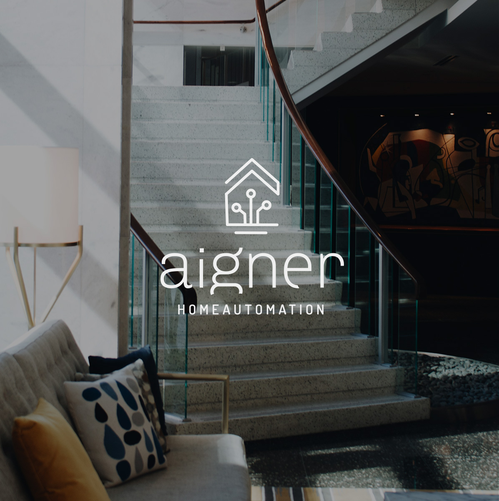
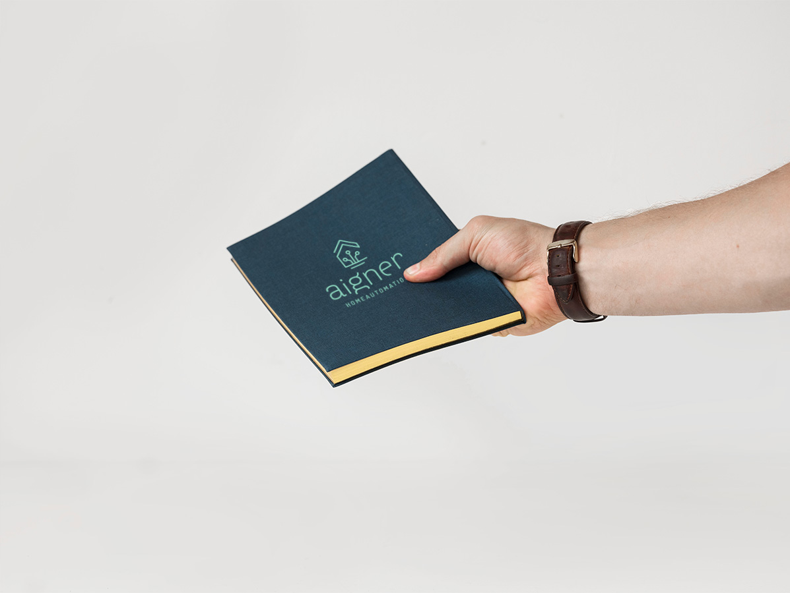
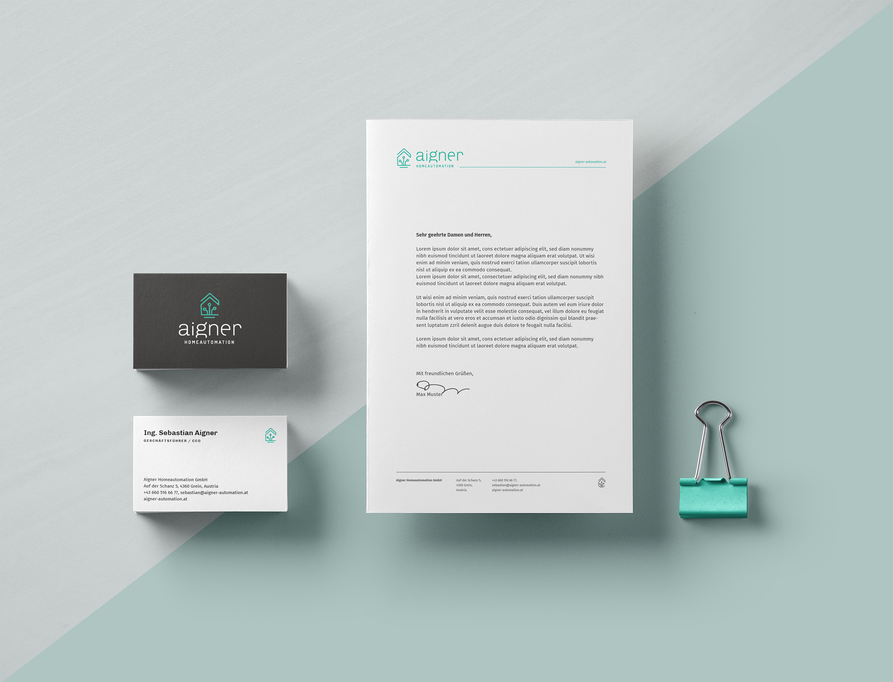
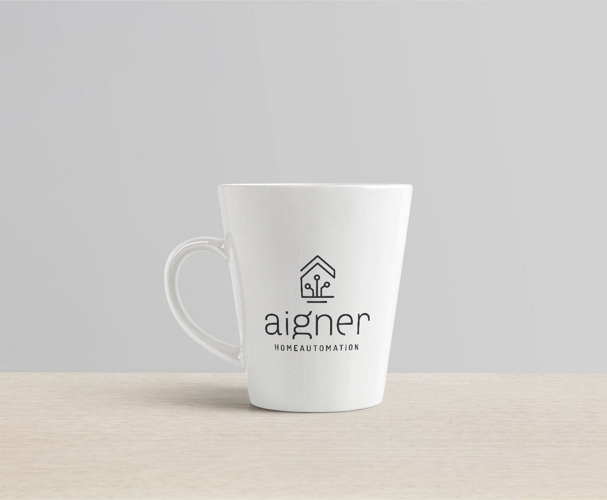
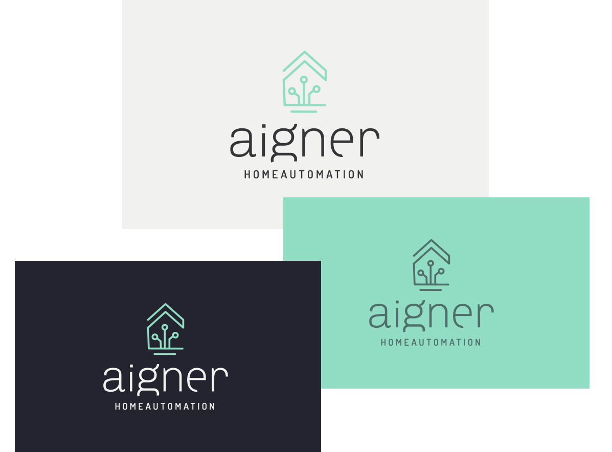
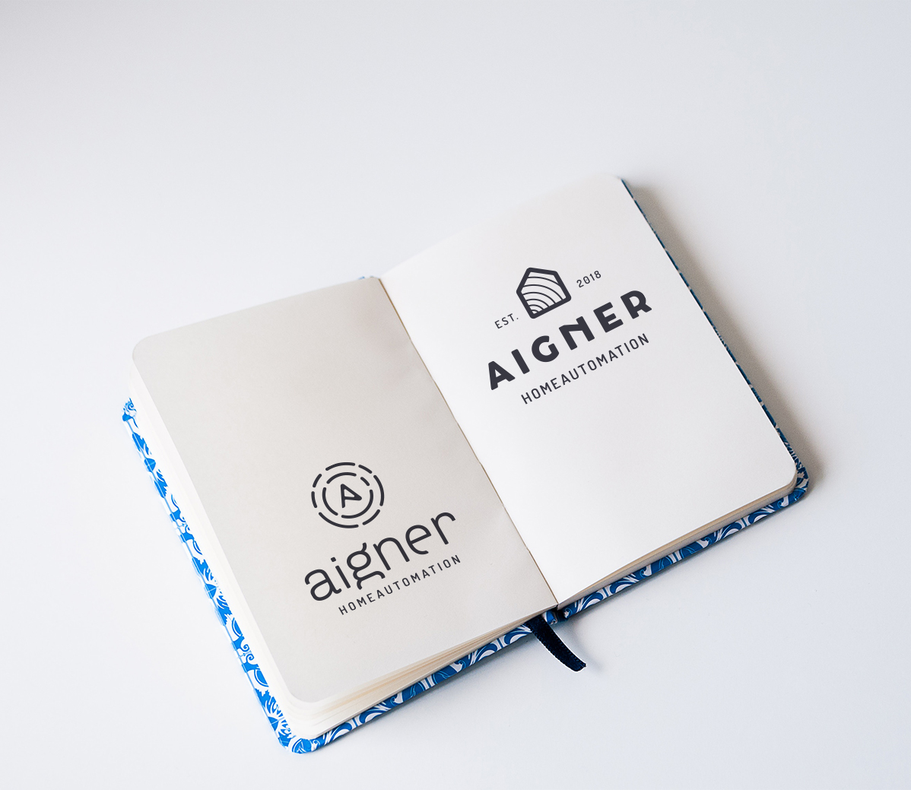

***

&nbsp;  
&nbsp;

&nbsp;  
&nbsp;

Aigner Homeautomation is an Austria based business providing custom tailored solutions for homes and companies to automize buildings. This lets the customer securely and digitally managing the home from remote. This representations unfolds some of the key features of the visual branding, emphasizing the core message of their product.

&nbsp;  
&nbsp;

Here are also some draft versions, which didn't make it to the final design:

