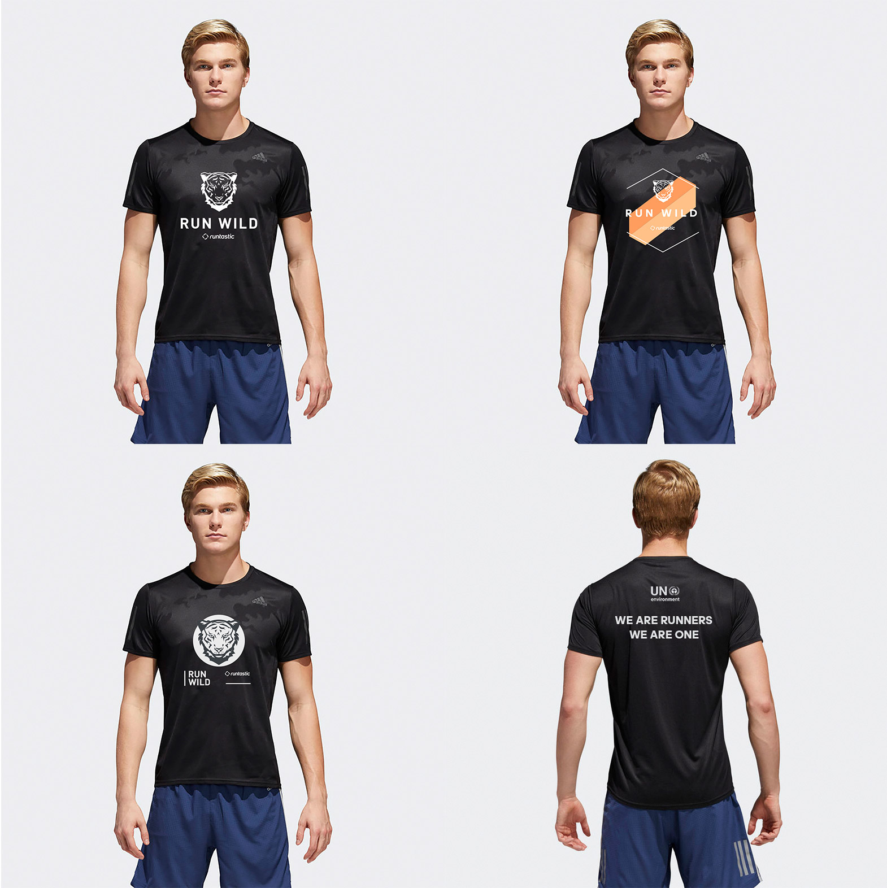

***
&nbsp;  
&nbsp;
Tigers once ranged widely across Eurasia, from the Black Sea in the west, to the Indian Ocean in the sough, and from Kolyma to Sumatra in the east.

&nbsp;  
&nbsp;

&nbsp;  
&nbsp;

Over the past 100 years, they have lost 93% of their historic rane, and have been extirpated from Western and Central Asia, from the islands of Java and Bali, and from large areas of Southeast, Southern and Eastern Asia.

Run Wild is a Campaign for World Wild Life Day and future Running Event designed to create awarness of the big cat’s critical situation.
„Some of us run to feel alive. Some of us run to stay alive.“

 I’ve created various version and styles to see what best fits to Runtastics and UNs vision. Here are my favorites:  
 
