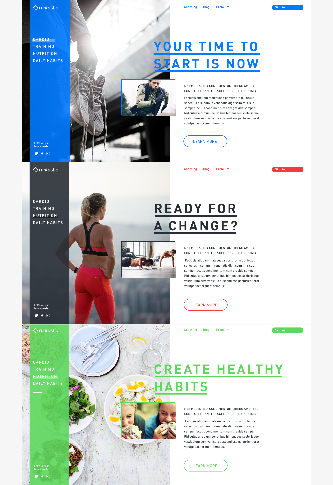

As the current Landingpage is already a bit outdated brand-wise, and confusing for the user - the Runtastic Web and Brand Team got together to develop a new strategy and design.
The new landingpage will consist of 4 sections which will tell the user about the four main parts of Runtastic: Cardio, Training, Nutrition and Daily Habits.

By the way, we also updated the Runtastic some time ago, read more about it on the [Runtastic Blog](https://www.runtastic.com/blog/en/new-runtastic-logo-same-awesome-us-yes-that-includes-you/)
